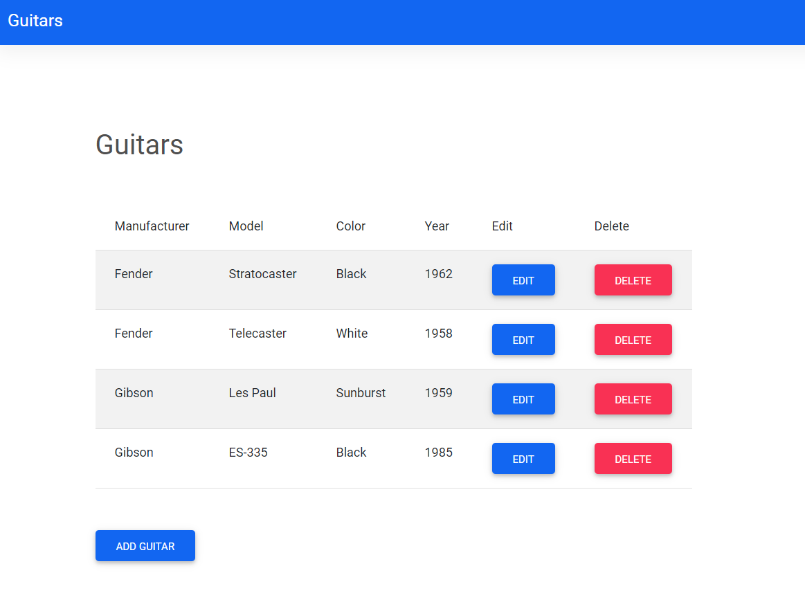

## guitar-collection-application



### Live Demo

[Live Demo](https://guitar-collection-application.up.railway.app)

### Built With

* Java 11
* Spring Boot
* Maven

### JAR File

You can build a JAR file and run it from the command line:

1. ```git clone https://github.com/josephkenny/guitar-collection-application.git```
2. ```cd guitar-collection-application```
3. ```./mvnw package```
4. ```java -jar target/*.jar```
5. Visit http://localhost:8080 in your web browser.

### Import Project in IDE

If you would like to work with the project in your IDE then follow these steps:

1. Clone the repo: ```git clone https://github.com/josephkenny/guitar-collection-application.git```
2. Import it in your preferred IDE and build the project to resolve the Maven dependencies.
3. Start the application through your IDE or enter the command ```mvnw spring-boot:run``` in the command line while you are in the root project directory.
4. Visit http://localhost:8080 in your web browser.
